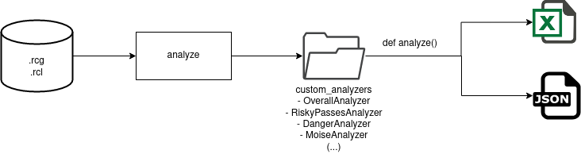
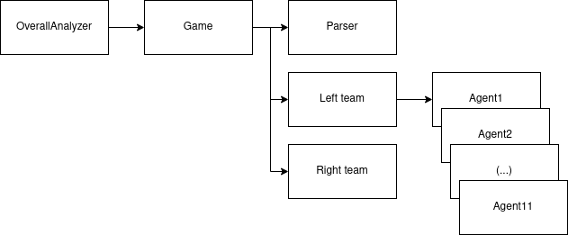

# ⚡️ loganalyzer 🔎

## Content
- [Overview](#Overview)
- [Classes](#classes)

## Overview

The diagram below shows the general workflow of the `loganalyzer` package:

The main module is inside the `analyze.py` file. It receives a path containing a single match (the name of the .rcg and .rcl logs) or a path to a folder containing some matches logs. It then organizes the execution of the analysis, passing these paths to an Analyzer object. All available analyzers are inside the `custom_analyzers` folder. Each Analyzer has an `analyze()` method, which defines how to extract the wanted informations from the logs. This information is extracted in a structured manner, which then is returned to the main module to become the output, which can be stored in a .csv or .json format.

You can run the loganalyzer using the commands specified [here](../README.md#how-to-use).

## Classes

The diagram above ilustrates how the classes interact.

- Parser: this class receives the path to the .rcg and .rcl logs. It then reads these files and transforms their information into python data structure (the .rcg information is transformed into a list of lists, containing all its information, and the .rcl information is transformed into a dictionary, filtering all "kick" and "tackle" actions). In this class, the information isn't separated.

- Analyzer: this class receives a `Game` object, from which it can access all the information available about the game, in a structured and divided way. The analyzer then is responsible to filter the wanted information (e.g.: the OverallAnalyzer filters from the game information the "ball possession", "number of shoots", "number of goals", "pass accuracy", etc, from each team). This information is stored in a dictionary, and then returned to the `analyze.py`, to be converted into a .csv or .json file.

- Game: this class receives a `Parser` object, separing the information into: left team information, right team information, ball information, and play mode information.

- Team: this class stores the information of a team: its name, side - left or right, and information about each player agent.

- Agent: this class stores all the detailed information related to a player (e.g.: moved distance, stamina usage, body, neck, and vision related information, etc).

If you want to improve the way general data is stored, you can change these classes. If you want to filter information related to a specific scenary, please create a new analyzer inside the `custom_analyzer` folder.
